# 🚀 Field Visit Tracker System

A web-based Field Visit Tracker System built using **Python**, **Django**, **SQLite**, **HTML**, **CSS**, and **Bootstrap**. The application helps organizations efficiently manage employees, track client visits, monitor attendance, and generate reports through an easy-to-use dashboard.

---

## 🌐 Live Demo

🔗 https://field-visit-tracker-cmoq.onrender.com

## Youtube Link
🔗 https://youtu.be/t6eHtXQa7uA

---

## 📌 Project Overview

The Field Visit Tracker System is designed to simplify the management of employees who perform field visits. It provides an organized platform to manage employees, record attendance, schedule and track client visits, and generate reports for better monitoring.

The system includes an administrator panel that allows complete control over employee records, attendance management, and visit tracking.

---

## 🎯 Project Objectives

- Simplify employee field visit management.
- Maintain accurate employee attendance records.
- Track client visits efficiently.
- Generate detailed reports for monitoring and analysis.
- Provide a centralized dashboard for administrators.
- Improve productivity through automated email notifications.

---

# ✨ Features

### 👨‍💼 Employee Management
- Add new employees
- Update employee information
- Delete employee records
- View employee details
- Role-based employee management

### 📅 Attendance Management
- Mark employee attendance
- View attendance records
- Edit attendance
- Attendance history

### 📍 Client Visit Management
- Add client visit details
- Track visit status
- Update visit information
- View visit history

### 📊 Dashboard
- Employee statistics
- Attendance summary
- Client visit summary
- Quick navigation

### 📄 Reports
- Attendance reports
- Employee reports
- Visit reports
- Export reports

### 🔐 Authentication
- Secure Login
- Django Admin Panel
- User Authentication
- Session Management

---

## 🔄 Application Workflow

Admin Login
↓
Manage Employees
↓
Employee Login
↓
Check-In
↓
Create Client Visit
↓
Check-Out
↓
Generate Reports
↓
Email Notifications

---

## 📸 Application Screenshots

### Authentication
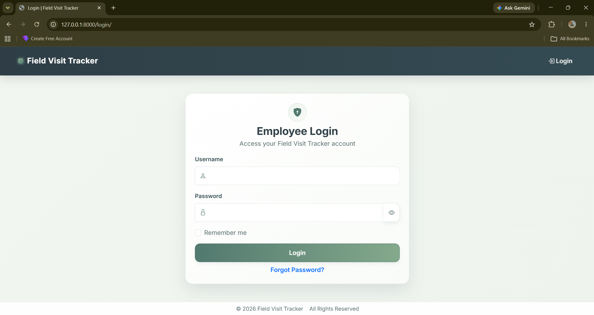

### Dashboard
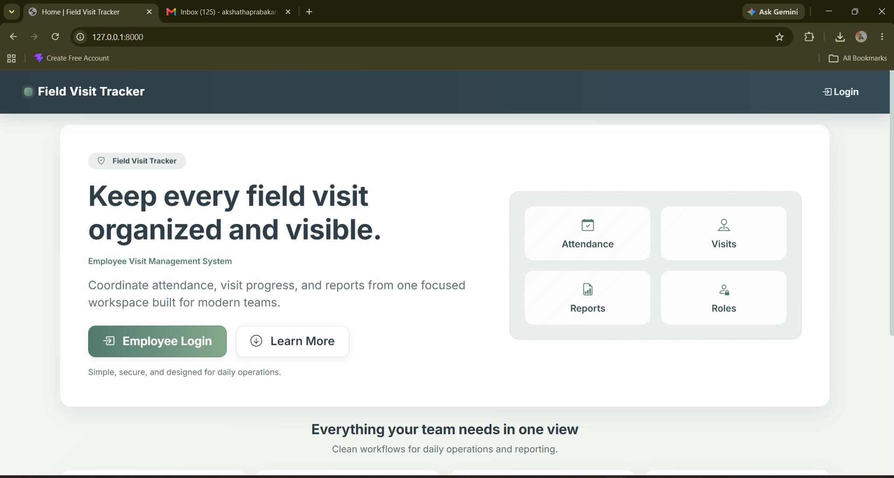
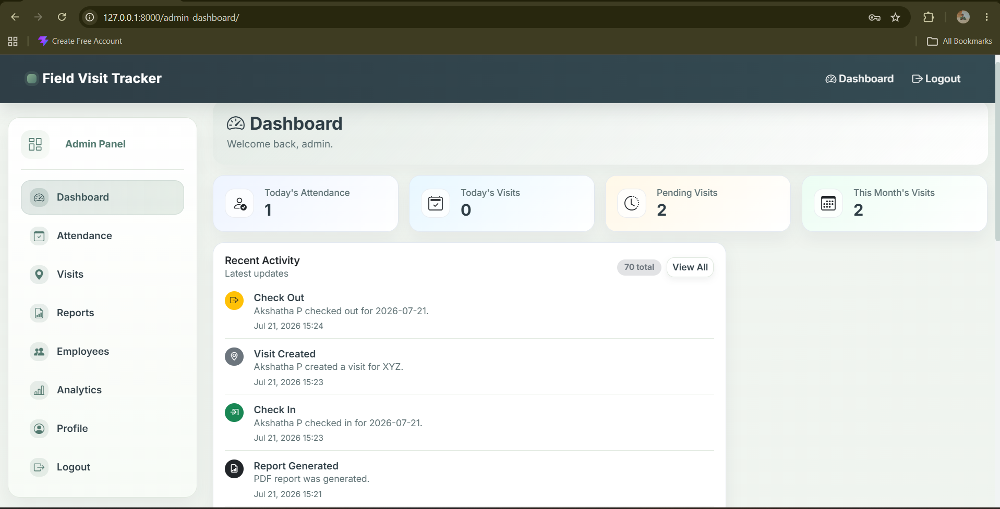

### Employee Management
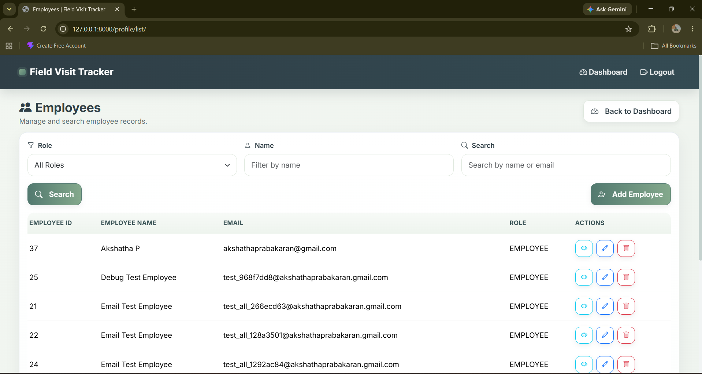
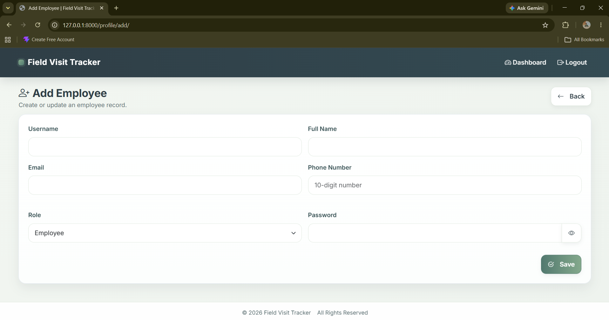
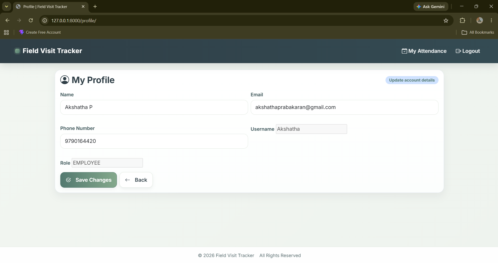

### Attendance Management
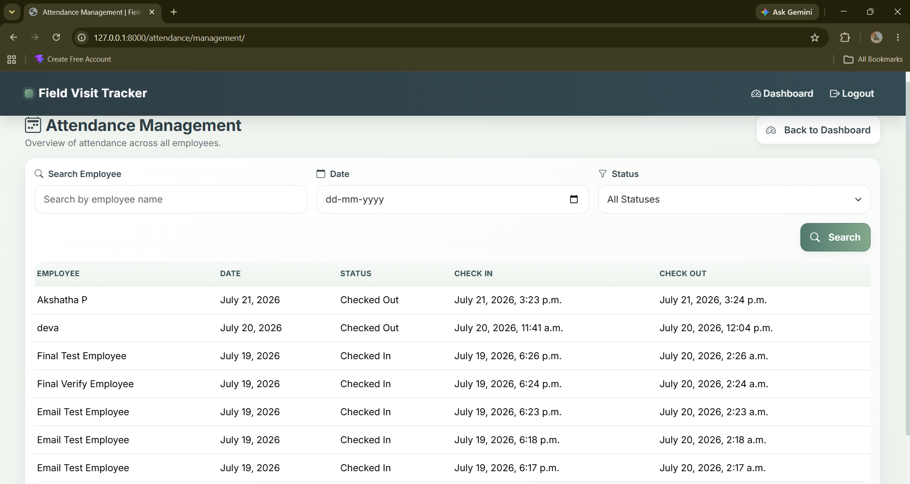
.png)

### Client Visit Management
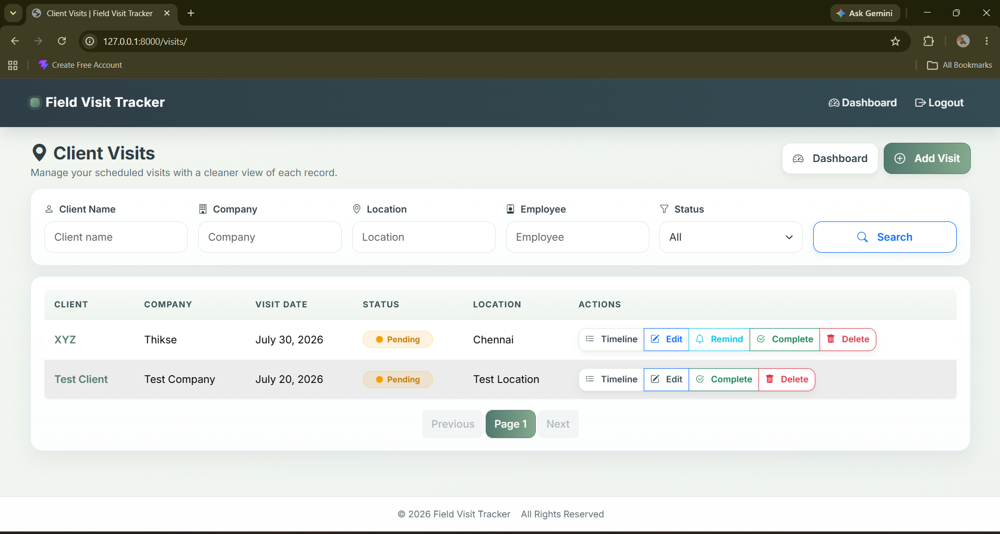

### Reports
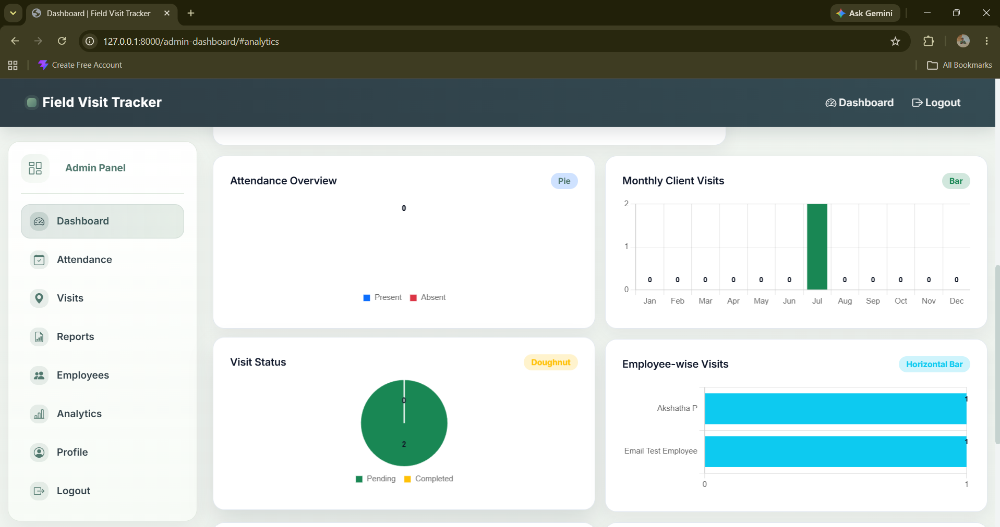
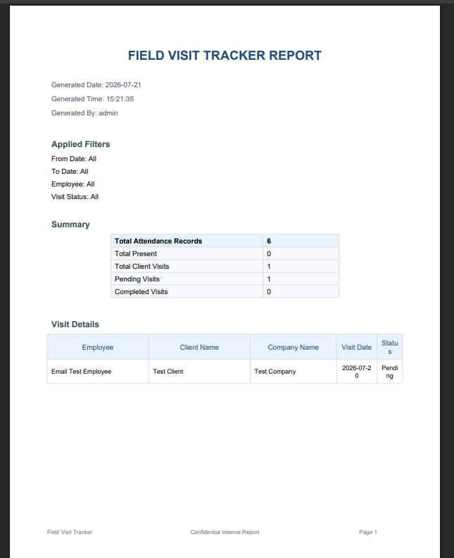
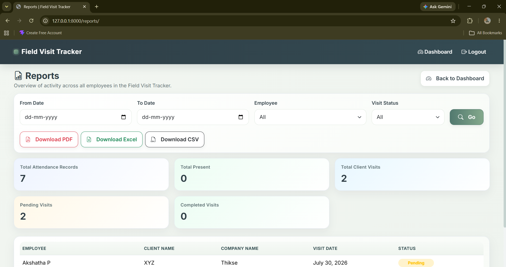

### Email Notifications
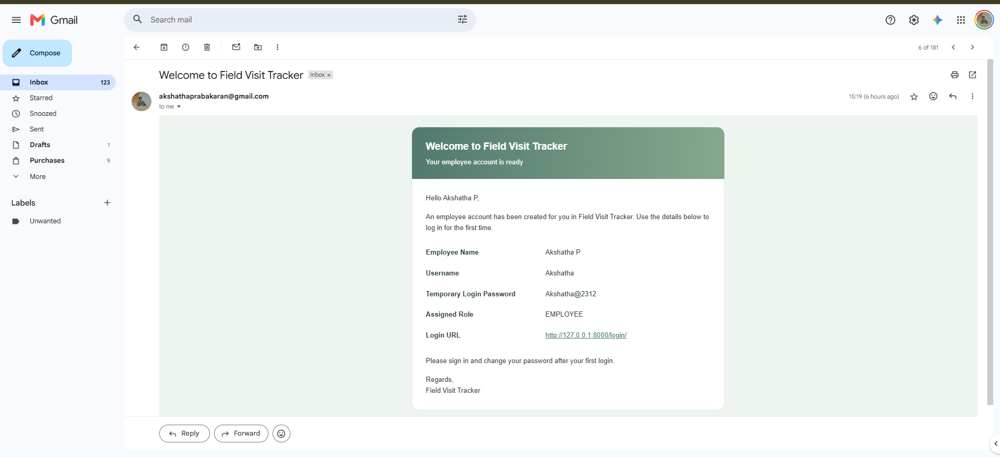
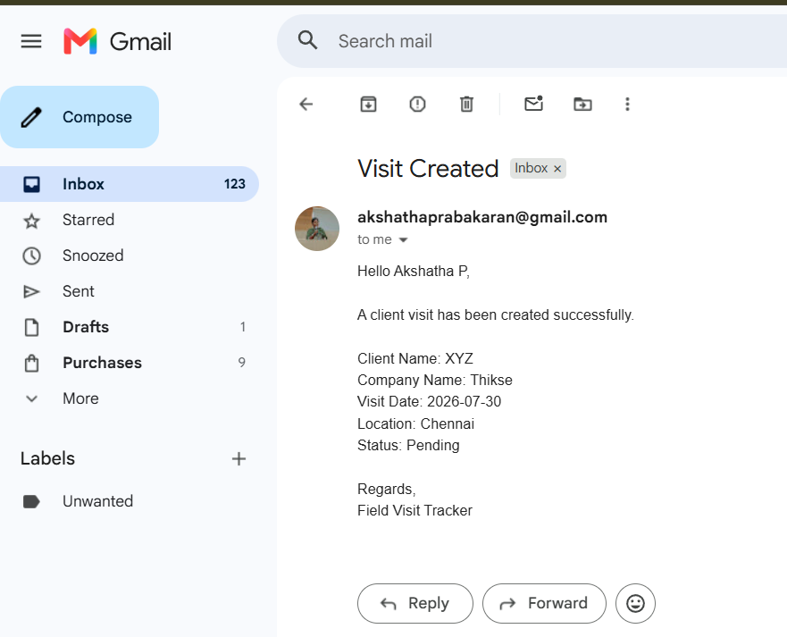

---

# 🛠️ Technology Stack

| Technology | Purpose |
|------------|---------|
| Python | Backend Programming |
| Django | Web Framework |
| SQLite | Database Management |
| HTML5 | Page Structure |
| CSS3 | Styling |
| Bootstrap | Responsive User Interface |
| JavaScript | Client-side Interactivity |
| Git | Version Control |
| GitHub | Repository Hosting |
| Render | Cloud Deployment |

---

## 🏗️ System Architecture

User
↓
Django Views
↓
Models
↓
SQLite Database
↓
Reports & Email Notifications

---

# 📂 Project Structure

```
FieldVisitTracker/
│
├── attendance/
├── dashboard/
├── employee/
├── reports/
├── visits/
├── templates/
├── static/
├── media/
├── FieldVisitTracker/
├── manage.py
├── requirements.txt
└── README.md
```

---

## 📋 Requirements

- Python 3.11 or above
- Django 5.x
- Bootstrap 5
- SQLite
- Git

---

# ⚙️ Installation

## Clone Repository

```bash
git clone https://github.com/Akshatha2312/Field-Visit-Tracker.git
```

Go to project directory

```bash
cd Field-Visit-Tracker
```

Create Virtual Environment

### Windows

```bash
python -m venv .venv
```

Activate Virtual Environment

```bash
.venv\Scripts\activate
```

Install Dependencies

```bash
pip install -r requirements.txt
```

Run Database Migrations

```bash
python manage.py migrate
```

Create Superuser

```bash
python manage.py createsuperuser
```

Run Development Server

```bash
python manage.py runserver
```

Open

```
http://127.0.0.1:8000
```

---

# 🚀 Deployment

The application is deployed using **Render**.

Deployment includes:

- Hosted on Render
- Gunicorn WSGI Server
- WhiteNoise for Static Files
- SQLite Database
- Automatic Static File Collection
- Production-ready Django Configuration

---

# 👤 Default Admin Credentials

For deployed demo:

```
Username : admin
Password : adminadmin
```

---

## 📦 Project Modules

- Authentication
- Dashboard
- Employee Management
- Attendance Management
- Client Visit Tracking
- Reports
- Django Admin

---

## 🧪 Testing

The following modules were tested:

- Login & Logout
- Employee CRUD Operations
- Attendance CRUD Operations
- Client Visit CRUD Operations
- Dashboard
- Reports
- Email Notifications
- Django Admin Panel

---

# 🔒 Security Features

- Authentication System
- Password Protection
- Session Authentication
- CSRF Protection
- Input Validation
- Form Validation

---

# 📚 Learning Outcomes

- Django MVC Architecture
- User Authentication
- Role-based Access Control
- Client Visit Tracking
- Report Generation
- Email Notification Workflows
- Django Template Engine
- Email Integration
- Report Generation

---

# 📈 Future Enhancements

- GPS Location Tracking
- Google Maps Integration
- Mobile Application
- Push Notifications
- Dark Mode
- AI-Based Visit Analytics
- MySQL/PostgreSQL Support
- Multi-language Support

---

# 🤝 Contributing

Contributions, suggestions, and improvements are welcome.

1. Fork the repository
2. Create a feature branch
3. Commit your changes
4. Push to your branch
5. Open a Pull Request

---

# 👩‍💻 Developer

**Akshatha Prabakaran**

LinkedIn:
https://www.linkedin.com/in/akshatha23/

GitHub:
https://github.com/Akshatha2312

---

# ⭐ Support

If you found this project useful, please consider giving it a ⭐ on GitHub.

---

## 📄 License

This project is developed for educational and portfolio purposes.